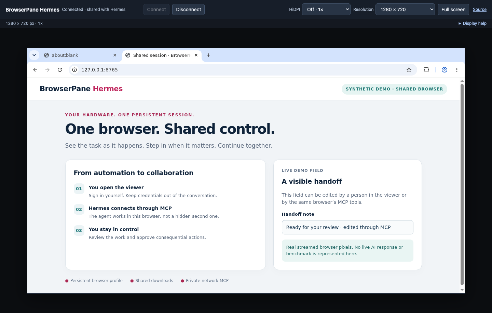

<p align="center">
  
</p>

<h1 align="center">BrowserPane Hermes</h1>
<p align="center"><strong>One browser. Your Raspberry Pi. You and your agent.</strong></p>
<p align="center">A small, self-hosted Docker Compose bundle for a persistent Chromium session,<br>an interactive remote viewer, and a Hermes agent connected over MCP.</p>

Browser automation does not have to happen in an invisible, disposable browser.
Open the viewer, sign in yourself, and let Hermes work in that **same session**.
When a task needs your judgment or MFA, take over. Your browser profile and
downloads remain on your machine across container restarts and recreation.

This is a focused fork of [BrowserPane](https://github.com/ITmedes/browserpane),
integrated with [Hermes Agent](https://github.com/NousResearch/hermes-agent).
It keeps BrowserPane’s native capture, tile/cache renderer, WebTransport, video
and audio paths, while replacing the platform administration layer with three
Compose services. It is an independent community integration, not an official
Raspberry Pi, BrowserPane, or Nous Research product.

## See the shared session



*A real streamed Chromium session in a disposable test container, not a UI mockup.
The page is a synthetic demo; no private browsing data or live model response is shown.*

## Why this bundle?

- **Human and agent see the same browser.** No second browser hidden behind MCP.
- **Persistent by default.** Separate volumes hold the browser profile, Hermes
  configuration/memory, and shared downloads.
- **Compact agent control.** This experimental branch adds five focused MCP
  tools, bounded observations and guarded action batches. The original Playwright
  MCP remains selectable; see the [protocol and limits](docs/COMPACT_MCP.md).
- **Managed ad blocking.** Upstream AdBlock with EasyPrivacy uses the persistent
  browser profile. See [installation, defaults and checks](docs/CONFIGURATION.md#managed-ad-blocking);
  blocking is not a security boundary or a guaranteed bandwidth reduction.
- **Designed around a little always-on box.** ARM64 support, CPU/X11 capture,
  a 720p-oriented automatic display policy, and carefully paired rendering fixes.
- **Small administration surface.** No separate database service, identity provider, broker,
  dashboard, or Docker socket. The browser itself is still a substantial workload.
- **Inspectable and repairable.** Pinned upstream revisions, ordered patches,
  corresponding source in the viewer, focused tests, and documented tradeoffs.

Useful for research with existing logins, form preparation, checking a web task
as it runs, assisted downloads into shared storage, and resuming a task later.
Give the agent explicit instructions to ask before submissions, purchases,
deletions, or other consequential actions. Shared access is not unlimited authority.

## Quick start

Use a **64-bit Linux host** with Docker Engine and the Compose plugin. Raspberry
Pi 4/5 with 8 GB RAM is the practical target; the measured reference was a Pi 4B
8 GB. An SSD, active cooling, and wired Ethernet are sensible for sustained use.
ARM64 and x86-64 images are build targets; the supported rendering baseline is
CPU Chromium on X11, not an experimental GPU path.

```sh
git clone https://github.com/grattis-digital/browserpane-hermes.git
cd browserpane-hermes
./scripts/setup.sh
docker compose build
docker compose up -d
./scripts/doctor.sh
```

The first source build compiles Rust and installs Chromium and Hermes. It can
take a while on a Pi and requires Internet access and spare disk space. Node,
Rust, and Python do **not** need to be installed on the host. Source revisions
and application dependencies are pinned; distribution packages and base-image
tags still receive updates, so builds are not claimed to be bit-reproducible.

The default is loopback-only at `https://localhost:8443/browser/`. For access
from another computer, edit `.env` before starting:

```dotenv
BIND_ADDRESS=192.168.1.50
VIEWER_HOST=pi-browser.home.arpa
HTTPS_PORT=8443
GATEWAY_PORT=4433
```

Use your Pi’s actual static/reserved LAN address. Make `VIEWER_HOST` resolve to
that address on the viewer computer, or use the IP itself. It is a hostname or
IP, **not a URL**. The bundle requires one explicit IPv4 bind address; wildcard
binding and IPv6-only deployments are rejected by the runtime validator before
Chromium starts.

### Trust HTTPS and permit the two viewer ports

Caddy creates a local CA. Export its **public root certificate** and trust it on
each viewer computer, following [configuration and TLS](docs/CONFIGURATION.md).
Never copy the CA private key. Use a current Chromium-based viewer browser with
WebTransport/WebCodecs support; an insecure certificate warning bypass is not a
substitute for installing trust.

Allow only trusted viewer computers to reach TCP `8443` and UDP `4433` on the
chosen bind address. HTTPS loads the viewer; WebTransport uses a separate direct
UDP connection. An HTTP reverse proxy or tunnel alone does not carry that stream.
Docker-published ports need Docker-aware firewall rules: UFW rules alone may not
filter them as expected. See [security and firewall guidance](docs/SECURITY.md).

**There is no viewer login or MCP authentication layer.** Anyone who can reach
the viewer can control its logged-in browser. Keep it on a genuinely trusted
network; never port-forward it to the Internet. MCP, browser debugging, and the
gateway administration API are not published to the host.

### Set up Hermes

```sh
docker compose exec hermes hermes model
docker compose exec hermes hermes --cli
```

Configure a provider and model through Hermes. OpenRouter is the documented
core-dependency path for this lean image; the wizard may offer other integrations
whose optional SDKs are not bundled. See the Hermes guide before selecting those.
Model usage may incur your provider’s charges; no API key is included. Credentials
and Hermes state live in the persistent agent volume, not the Git repository or image.

Self-hosted browser state does **not** mean all task data stays local: page text,
screenshots and file contents used by Hermes may be sent to your configured model
provider. Choose accounts, tasks and a provider appropriate to that privacy boundary.

The bundled configuration connects Hermes to `http://browserpane:8931/mcp`,
selects the `browserpane` toolset, and disables Hermes’s separate native browser
toolset. Ask it, for example:

> Use the shared BrowserPane browser to inspect the current page. Summarize it
> without navigating away. Ask me before sending data or submitting anything.

See [Hermes setup, tool names, and existing-agent integration](docs/HERMES.md).

## How it fits together

```text
Your browser ── HTTPS ──► web (Caddy) ──► viewer/bootstrap
             └── UDP/WebTransport ─────► browserpane
                                         │ one Chromium + persistent profile
Hermes agent ── internal MCP ─────────────┘
     └──────── shared files /shared ──────┘
```

| Service | Responsibility | Persistent data |
| --- | --- | --- |
| `browserpane` | Chromium, X11 capture, gateway, viewer and MCP bridge | `/data` browser profile |
| `hermes` | Agent CLI and background gateway | `/opt/data` config, credentials, memory |
| `web` | HTTPS entry point and local CA | Caddy certificate/CA state |

BrowserPane and Hermes also share `/shared`; genuine browser downloads are in
`/shared/downloads`. MCP diagnostic artifacts are isolated from downloads.
The browser profile and Hermes credentials are **not** cross-mounted.

The first connected viewer owns shared capture resizing. Other viewers fit the
same capture locally. Resolution presets set actual capture pixels; HiDPI adjusts
local display density and fitting, not Chromium’s shared DPI or zoom. Small
captures are centered. See [display controls](docs/DISPLAY.md).

## What is different from other approaches?

| Approach | What it is good at | Tradeoff this bundle addresses |
| --- | --- | --- |
| Headless browser automation | Repeatable unattended jobs and fresh contexts | Here you can see and take over a persistent desktop browser |
| A conventional VNC desktop | General-purpose remote desktop access | Here the browser, shared files and agent MCP connection come pre-wired |
| A hosted browser service | Managed capacity and remote infrastructure | Here browser state stays on infrastructure you operate; you also maintain it |
| The full BrowserPane platform | Broader administration and multi-service deployments | Here one trusted shared session has a much smaller operational surface |

This is not a claim that every alternative is slower or cannot support MCP.
The specialization is the ready-to-run combination and its explicit one-session
contract. It is not multi-tenant isolation, a cloud browser fleet, or a general
desktop replacement.

## Performance, correctness, and upstream backports

The fork carries changes to capture scheduling, buffer reuse, scroll detection,
tile/subtile caches, client GPU texture reuse, stream recovery, and display
geometry. Host, gateway, and client must be upgraded together.

On the earlier Pi 4B qualification, keyboard input-to-completed-tile latency
fell from **127 ms to 22.3 ms median** (180 physical key events per version).
That measures the host portion, **not end-to-end input-to-photon latency**.
Later correctness fixes prioritize complete frames over optimistic stale tiles;
they are not all speed improvements. No universal 60 FPS or bandwidth guarantee
is claimed.

Read the [optimization evidence and limits](docs/OPTIMIZATIONS.md) and
[ordered backport guide](docs/BACKPORTING.md). GPU experiments are documented as
research, not enabled in the supported Compose configuration.

## Operations and development

- [Configuration, TLS, networking, backups and upgrades](docs/CONFIGURATION.md)
- [Hermes and MCP integration](docs/HERMES.md)
- [Security boundaries and reporting](docs/SECURITY.md)
- [Development and verification](CONTRIBUTING.md)
- [Source provenance and dependency attribution](UPSTREAM.md)

`docker compose down` preserves named volumes. **`docker compose down -v`
deletes them**, including profile, credentials and CA state. Keep the Compose
project name stable across upgrades, and stop writers before making backups.

The pipelines are tailored to this bundle: patch replay, wrapper/client/native
regressions, Compose and exposure checks, real container smoke tests, MCP and
profile persistence, and architecture-specific image builds. Hosted ARM64 checks
verify that architecture, not Pi hardware latency. Publishing is separately gated;
pull requests do not get registry credentials or run paid model calls.

## License and acknowledgments

The BrowserPane derivative retains the upstream [AGPL-3.0 license](LICENSE).
Hermes and other dependencies retain their own licenses; see [UPSTREAM.md](UPSTREAM.md).
The viewer’s **Source** link serves the corresponding bundled source. Preserve
notices and review the obligations relevant to your distribution or changes.

Thanks to the BrowserPane, Hermes, Chromium, Playwright, Rust and Linux projects
whose work makes this small shared-browser setup possible. The original project
mark was created with AI assistance; it does not imply affiliation with those projects.
